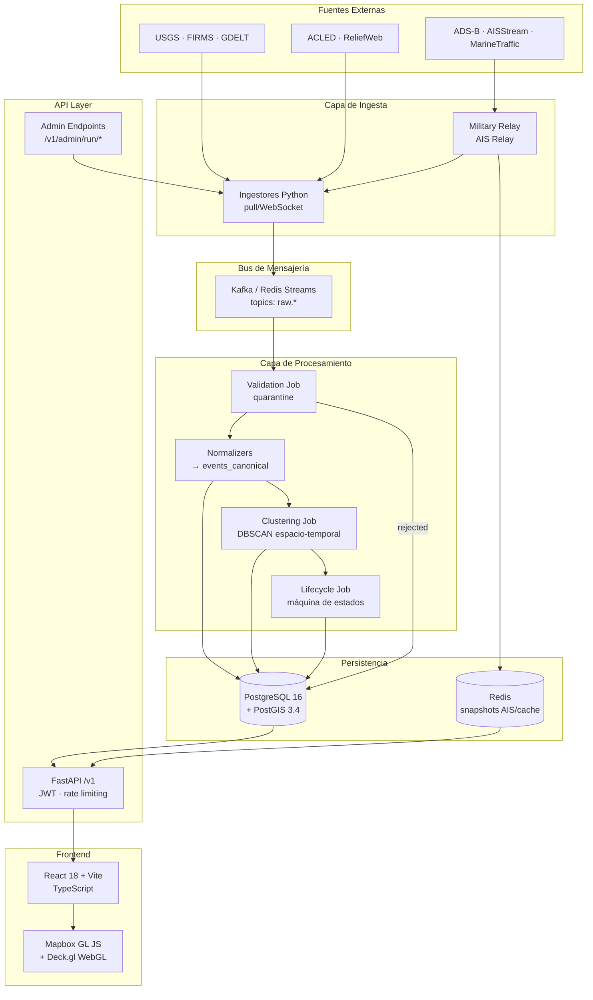
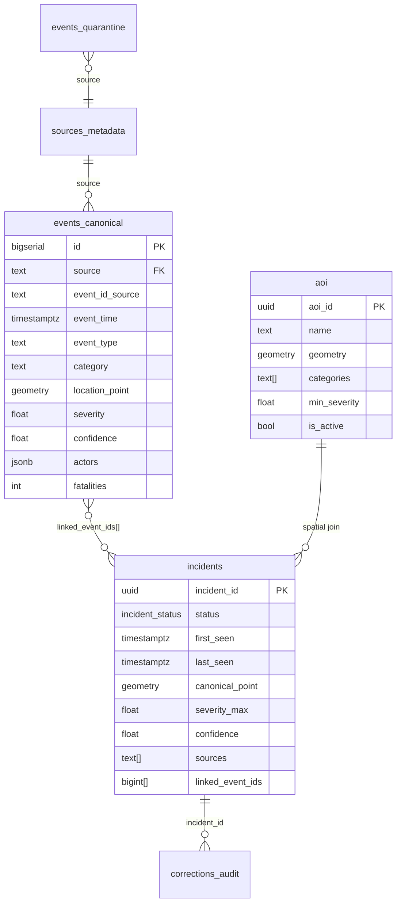
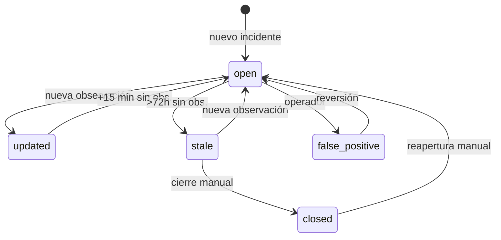

# GEO SENTINEL — Documentación Técnica de Arquitectura

**Versión:** 1.0 | **Clasificación:** Técnica / Portfolio  
**Stack principal:** Python 3.12 · FastAPI · PostgreSQL/PostGIS · React 18 · Deck.gl · Mapbox GL JS

---

## 1. Resumen del Proyecto

GEO SENTINEL es una plataforma de **inteligencia geoespacial en tiempo real** orientada a operaciones tácticas de Comando y Control (C2). El sistema agrega, normaliza y canoniza eventos de múltiples fuentes heterogéneas —sensores satelitales, feeds AIS/ADS-B, bases de datos de conflictos y APIs sísmicas— en un modelo de incidente unificado, exponiendo el estado operacional global a través de una API REST versionada y un dashboard C2.

| Dimensión | Detalle |
|-----------|---------|
| **Tipología** | Sistema distribuido de agregación de inteligencia |
| **Paradigma** | Microservicios + pipeline ETL asíncrono |
| **Dominio** | Geoespacial / OSINT / Defensa |
| **Tiempo de respuesta** | Nowcasting — ventana deslizante 7–30 días |
| **Fuentes integradas** | 9 (USGS, FIRMS/NASA, GDELT, ACLED, ADS-B, AISStream, MarineTraffic, Liveuamap, ReliefWeb) |
| **Complejidad técnica** | Alta — procesamiento geoespacial, clustering espacio-temporal, fusión multi-fuente, visualización WebGL |

---

## 2. Arquitectura General

Arquitectura de microservicios con pipeline de procesamiento en capas. Cada capa tiene responsabilidad única y se comunica de forma asíncrona mediante broker de mensajería.



### Flujo de datos end-to-end

```
Fuente externa → Ingestor → Kafka → Validación → Normalización
→ events_canonical → Clustering DBSCAN → incidents → API → Frontend
```

Latencia extremo a extremo (fuente → `/v1/incidents`):

| Fuente | SLA objetivo |
|--------|-------------|
| USGS | < 5 min |
| FIRMS | < 3 h |
| GDELT | < 20 min |
| ADS-B / AISStream | < 3 min |
| ACLED | < 24 h desde publicación |

---

## 3. Stack Tecnológico

### Backend

| Componente | Tecnología | Rol |
|------------|-----------|-----|
| Runtime | Python 3.12 | — |
| API Framework | FastAPI 0.111 | REST API, background tasks, auth middleware |
| ORM | SQLAlchemy 2.x async | Acceso a datos, migraciones via Alembic |
| Base de datos | PostgreSQL 16 + PostGIS 3.4 | Persistencia + queries geoespaciales |
| Caché / streams | Redis 7 | Snapshots AIS, deduplicación, cola de jobs |
| Mensajería | Kafka (prod) / Redis Streams (dev) | Desacoplamiento ingesta-procesamiento |
| Scheduler | APScheduler / Airflow | Orchestración de jobs periódicos |
| Validación | Pydantic v2 | Schemas de entrada/salida, validación de datos |

### Frontend

| Componente | Tecnología | Rol |
|------------|-----------|-----|
| Framework | React 18 + TypeScript | — |
| Build | Vite 5 | Bundling, HMR, env vars |
| Mapa base | Mapbox GL JS 3.x | Tiles satelitales, estilos oscuros tácticos |
| Capas WebGL | Deck.gl 9.x | ScatterplotLayer, PathLayer, HeatmapLayer, IconLayer |
| Estado servidor | TanStack Query 5 | Polling, caché, invalidación, retry |
| Estado UI | Zustand 4 | Viewport, filtros, selección, auth |
| Estilo | Tailwind CSS 3 | Design system C2 dark/glassmorphism |
| Animaciones | Framer Motion 11 | Pulso hotspots, transiciones de panel |

### Infraestructura

| Componente | Tecnología |
|------------|-----------|
| Contenedores | Docker + Docker Compose (dev) / Kubernetes (prod) |
| Servidor frontend | Nginx (contenedor multi-stage) |
| CI/CD | Pre-commit hooks (ruff, mypy, eslint, tsc) |
| Secretos | `.env` local / Kubernetes Secrets + KMS (prod) |
| Monitorización | Prometheus metrics + Grafana |

---

## 4. Modelo de Datos

Esquema normalizado en PostgreSQL con extensión PostGIS para operaciones geoespaciales nativas.



**Decisiones de diseño clave:**

- Todo timestamp: `TIMESTAMPTZ` UTC — normalización en mapper, nunca posterior
- Geometrías en WGS84 (EPSG:4326) con índices `GIST` para queries espaciales eficientes
- `corrections_audit` append-only — trazabilidad inmutable de intervenciones humanas
- `severity` y `confidence`: Float [0.0–10.0] normalizados por categoría de incidente
- `fatalities_total` en incidentes: `MAX()` sobre observaciones, nunca `SUM()` (previene doble conteo multi-fuente)

---

## 5. Pipeline de Procesamiento

### 5.1 Ingesta y Normalización

Cada fuente tiene un ingestor dedicado con su mapper de normalización. El pipeline es tolerante a fallos por diseño: el fallo de un ingestor no afecta al resto.

```
Ingestor → retry/backoff exponencial + circuit breaker
        → topic Kafka raw.<source>
        → Validation Job (6 códigos de rechazo → events_quarantine)
        → Mapper (→ EventCanonicalCreate Pydantic schema)
        → Deduplicación por clave natural por fuente
        → INSERT events_canonical
```

**Clases de independencia de fuente** — usadas en el modelo de confianza:

| Clase | Factor | Ejemplos |
|-------|--------|---------|
| `sensor` | ×2.0 | USGS, FIRMS, ADS-B, AISStream |
| `field_reported` | ×1.5 | ACLED, ReliefWeb |
| `media_derived` | ×0.5 | GDELT, Liveuamap |

El modelo de confianza penaliza fuentes correlacionadas: múltiples fuentes `media_derived` sobre el mismo hecho no incrementan la confianza linealmente, ya que probablemente extraen del mismo ciclo de noticias.

### 5.2 Clustering Espacio-Temporal

Algoritmo DBSCAN con métrica mixta normalizada para agrupar eventos en incidentes canónicos:

```
d(e1, e2) = w_space · (haversine_km / KM_MAX) + w_time · (Δhoras / HOURS_MAX)
```

Parámetros (epsilon, pesos) configurables por categoría de incidente. Restricción fuerte: eventos de categorías distintas nunca se agrupan independientemente de su proximidad geográfica.

### 5.3 Ciclo de Vida del Incidente

Máquina de estados explícita con transiciones auditadas:



---

## 6. Seguridad

| Aspecto | Implementación |
|---------|---------------|
| Autenticación | JWT RS256, expiración 24h, refresh tokens 30d |
| Autorización | Scopes: `incidents:read`, `corrections:write`, `aoi:manage`, `admin:run` |
| Rate limiting | 100 req/min autenticado, 10 req/min escritura |
| Secretos | `.env` local / Kubernetes Secrets + KMS en prod |
| API keys de fuentes | Solo en variables de entorno del relay — nunca en frontend |
| Datos sensibles | `hexCode` ADS-B y `MMSI` nunca expuestos en API pública |
| Auditoría | `corrections_audit` append-only, retención 90 días de logs de acceso |
| Licencias de datos | ACLED (CC BY-NC 4.0), ADS-B/MT (comercial) — filtrado en capa API |

---

## 7. Frontend — Dashboard C2

Interfaz de operaciones en tiempo real con estética militar (dark/glassmorphism) diseñada para uso prolongado bajo condiciones de baja iluminación.

**Arquitectura de capas de visualización:**

```
Mapbox GL JS (motor de mapa base, tiles satelitales)
    └── DeckGL independiente (canvas WebGL propio)
          ├── ScatterplotLayer    — incidentes y buques
          ├── PathLayer          — trails de vuelos/buques
          ├── HeatmapLayer       — densidad de actividad
          ├── PolygonLayer       — AOIs
          └── IconLayer          — vuelos militares (SVG atlas inline)
```

DeckGL opera con contexto WebGL independiente de Mapbox para garantizar compatibilidad total con `IconLayer` y capas de textura.

**Patrón de datos en tiempo real:** polling con TanStack Query (30s incidentes, 60s estado fuentes) con invalidación reactiva al completar jobs de ingesta manual.

**Panel de control de ingesta (`/v1/admin/run/*`):** los operadores pueden disparar manualmente cualquier ingestor o el pipeline completo desde la UI, con feedback en tiempo real del estado del job (polling de estado cada 2s), resultado detallado (eventos fetched/inserted, incidentes creados) y refresco automático del mapa al completar.

---

## 8. Calidad y Operaciones

### Backpressure — Verificación automática post-commit

Pipeline de calidad determinista configurado con `pre-commit`:

| Hook | Herramienta | Verifica |
|------|------------|---------|
| Linting Python | `ruff check` | Convenciones, imports, bugs comunes |
| Formateo Python | `ruff format` | Consistencia de estilo |
| Tipos Python | `mypy --strict` | Correctitud de tipos estática |
| Código muerto | `vulture` | Funciones/variables no referenciadas |
| Complejidad | `radon cc` | Complejidad ciclomática > 10 |
| Tipos TypeScript | `tsc --noEmit` | Correctitud de tipos frontend |
| Linting TS | `eslint` | Convenciones frontend |
| Secretos | `detect-private-key` | API keys hardcodeadas |

Ningún commit puede realizarse hasta que todos los hooks pasen. El agente de implementación no puede saltarse la verificación.

### Monitorización

Métricas Prometheus por ingestor: `ingestor_poll_total`, `ingestor_errors_total`, `ingestor_latency_seconds`, `ingestor_circuit_open`. Alertas automáticas si el lag supera el SLA×2 por fuente o si `events_quarantine_unresolved > 100` en 30 minutos.

### Metodología de Desarrollo

El proyecto sigue **Specification-Driven Development (SDD)**: toda funcionalidad se especifica completamente en Markdown estructurado antes de implementarse. `AGENTS.md` actúa como índice de enrutamiento para el agente de implementación, garantizando contexto consistente entre sesiones de desarrollo. Las specs se dividen en estructurales (reglas globales inmutables) y funcionales (comportamiento por componente).

---

## 9. Escalabilidad y Extensibilidad

| Característica | Mecanismo |
|----------------|-----------|
| **Escalado horizontal de ingestores** | Cada ingestor es un proceso independiente sin estado local |
| **Nuevas fuentes** | Implementar ingestor + mapper; el pipeline de procesamiento es agnóstico a la fuente |
| **Alta disponibilidad** | Circuit breaker por fuente; fallo de ingestor no propaga errores al pipeline |
| **Datos stale** | Relays AIS/ADS-B sirven última lectura válida si upstream falla |
| **Archivado** | Incidentes fuera de ventana activa se mueven a `incidents_archive` (MOVE, nunca DELETE) |
| **WebSockets** | Arquitectura preparada; polling actual sustituible por SSE/WS sin cambios en el modelo de datos |
